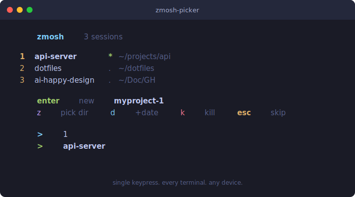

# zmosh-picker

Session launcher for [zmosh](https://github.com/mmonad/zmosh). One keypress to resume any session.

<p align="center">
  
</p>

## Why

The idea is simple: if every terminal on your Mac starts inside a zmosh session, then every session is always there waiting for you when you pick up your phone.

I SSH from my phone a lot. The annoying part was never the SSH itself — it was arriving on the remote machine and not knowing what sessions exist, or having to type `zmosh attach some-long-name` on a phone keyboard. Half the time I'd just start fresh and lose whatever I was working on.

So I made this run on every terminal. Now my Mac is constantly creating and resuming named sessions without me thinking about it. When I SSH from my phone later, those sessions are right there. Press `1`. Done.

It also handles new sessions — `Enter` creates one named after your current directory, `z` lets you pick a project via zoxide first. But the real point is: your Mac does the work of keeping sessions alive, and your phone just picks them up.

## Dependencies

| Dependency | Required | What it does |
|-----------|----------|---------|
| [zmosh](https://github.com/mmonad/zmosh) | **Yes** | Session persistence (fork of [zmx](https://github.com/neurosnap/zmx)) |
| [zoxide](https://github.com/ajeetdsouza/zoxide) | No | Directory picker for the `z` key |
| [fzf](https://github.com/junegunn/fzf) | No | Fuzzy finder, used by zoxide |

```bash
# macOS
brew install mmonad/tap/zmosh
brew install zoxide    # optional
brew install fzf       # optional, used by zoxide
```

## Install

```bash
git clone https://github.com/nerveband/zmosh-picker.git
cd zmosh-picker
./install.sh
```

The install script checks for dependencies, copies the script to `~/.local/bin/`, and adds a source hook to `~/.zshrc`. If you use Powerlevel10k, it places the hook before instant prompt so the picker can actually read keyboard input.

Open a new terminal and you should see it.

## Upgrade

```bash
cd zmosh-picker
git pull
./install.sh
```

The install script copies the latest version to `~/.local/bin/`. Open a new terminal to use the updated picker.

## Usage

```
  zmosh 3 sessions

  1  api-server * ~/projects/api-server
  2  dotfiles . ~/dotfiles
  3  ai-happy-design . ~/Doc/GH/ai-happy-design

  enter new myproject
  c custom  z pick dir  d +date  k kill  esc skip

  >
```

### Keys

| Key | What happens |
|-----|--------|
| `1`-`9` | Attach to that session |
| `a`-`y` | Sessions 10+ |
| `Enter` | New session in current directory |
| `c` | Custom name — type a name, then pick where to create it |
| `z` | Pick a directory with zoxide, then new session there |
| `d` | New session with today's date as suffix |
| `k` | Kill mode — pick a session to kill (returns to menu after) |
| `Esc` | Skip, just give me a normal shell |

Everything is single-press. No typing names, no confirming.

### Session names

| Key | Format | Example |
|-----|--------|---------|
| `Enter` | `<dirname>` or `<dirname>-<N>` | `api-server`, then `api-server-2` |
| `c` | whatever you type | `my-thing` |
| `d` | `<dirname>-MMDD` | `api-server-0220` |
| `z` | `<picked-dir>` or `<picked-dir>-<N>` | `ai-happy-design`, then `ai-happy-design-2` |

First session gets the bare name. Counter starts at `-2` only when a conflict exists.

### The `*` and `.` indicators

`*` (green) means someone is connected to that session right now. Probably you, on another device. `.` means it's idle — pick it up.

## How it works

The `.zshrc` hook sources the script before p10k instant prompt. It calls `zmosh list` once, builds the menu, waits for one keypress, then runs `exec zmosh attach <name>` which replaces the shell process entirely. The rest of `.zshrc` never runs — so resuming a session is actually faster than a normal shell startup.

The picker skips itself when you're already inside a zmosh session, in a non-interactive shell, or when stdin isn't a terminal.

### `zpick`

If you're already inside a session and want to switch, type `zpick`. It brings up the same picker, lets you pick a session, and attaches to it. The install script adds this alias automatically.

### Killing sessions

Press `k` to enter kill mode, then pick a session number to kill. You'll be asked to confirm with `y/n`. To skip confirmation, add this to your `.zshrc`:

```bash
export ZMOSH_PICKER_NO_CONFIRM=1
```

## Works on narrow screens

The layout fits ~30 character widths. Action keys are stacked on two lines. No padding on session names. I built this mostly so I could SSH from my phone (Echo) and not hate the experience.

## Related projects

- [zmosh](https://github.com/mmonad/zmosh) — Session persistence with UDP remote support
- [zmx](https://github.com/neurosnap/zmx) — The session persistence tool zmosh is forked from
- [zmx-session-manager](https://github.com/mdsakalu/zmx-session-manager) — TUI session manager for zmx/zmosh
- [zoxide](https://github.com/ajeetdsouza/zoxide) — Frecency-based `cd` replacement
- [fzf](https://github.com/junegunn/fzf) — Fuzzy finder

## Design

See [docs/plans/2026-02-20-zmosh-picker-design.md](docs/plans/2026-02-20-zmosh-picker-design.md) for the full rationale.

## Uninstall

```bash
./uninstall.sh
```

## License

MIT
