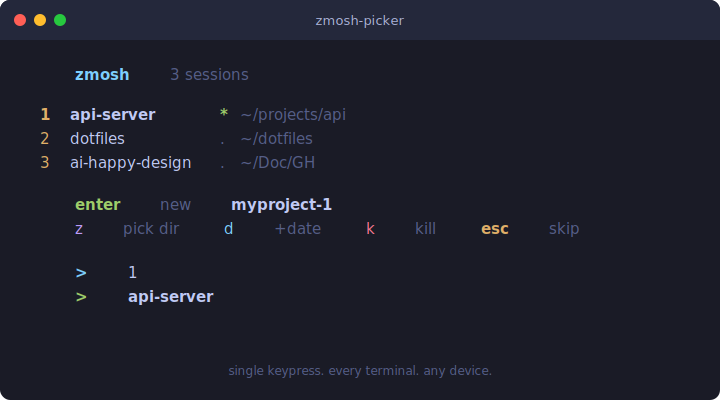

# zp

A single-keypress session picker that works with multiple terminal session managers. Press a number, you're in.

<p align="center">
  
</p>

## What it does

zp gives you a fast TUI for listing, creating, attaching, and killing sessions — even from inside an existing session. It doesn't care which session manager you use. Pick whichever you like:

| Backend | What it is |
|---------|-----------|
| [tmux](https://github.com/tmux/tmux) | The standard terminal multiplexer |
| [zellij](https://zellij.dev) | Modern terminal workspace with panes and tabs |
| [zmosh](https://github.com/mmonad/zmosh) | Session persistence with UDP remote support |
| [zmx](https://github.com/neurosnap/zmx) | Lightweight session manager (zmosh is forked from this) |
| [shpool](https://github.com/shell-pool/shpool) | Shell session pooling daemon |

zp auto-detects which backends you have installed. If you have more than one, it asks you to pick on first run and saves your choice.

## Install

Download a pre-built binary from [GitHub Releases](https://github.com/nerveband/zpick/releases/latest). Builds are available for macOS and Linux, both arm64 and amd64.

You can also use the install script:

```bash
curl -fsSL https://raw.githubusercontent.com/nerveband/zpick/main/install.sh | bash
```

The installer automatically adds a shell hook to your config (`.zshrc`, `.bashrc`, or fish `conf.d/00-zp.fish`). The hook is required — it lets `zp` attach sessions in your current shell, autostarts the picker in fresh interactive TTY shells before slower prompt/plugin setup, enables autorun, and enables in-session switching. It skips non-interactive shells and command-mode SSH/scp runs. On macOS it also creates a `/usr/local/bin/zp` symlink for system-wide PATH access.

`zp upgrade` updates the binary, then checks whether the managed hook block changed in this release and offers to refresh it.

To remove the hook:

```bash
zp remove-hook
```

### Self-update

```bash
zp upgrade
```

Downloads the latest release binary directly. No package manager needed.

## Session guard

The guard is optional but useful. It wraps specific commands so that if you run them outside a session, you get a quick prompt:

```
  ⚡ Not in a tmux session. Press ENTER to pick one (10s)  esc skip
```

Press Enter to pick a session (the original command auto-launches inside it). Or just wait 10 seconds and the command runs normally. This is handy for AI coding tools where losing your session halfway through is annoying.

To install the guard (this also installs the hook if it's missing):

```bash
zp install-guard
```

By default, the guard covers `claude`, `codex`, and `opencode`. You can change that:

```bash
zp guard --add aider       # start guarding aider
zp guard --remove codex    # stop guarding codex
zp guard --list            # see what's guarded
```

To remove just the guard wrappers (keeps the shell hook):

```bash
zp remove-guard
```

Run `zp guard` with no arguments for a full explanation of how it works.

## In-session switching

Run `zp` inside an active session and it detects you're already in one. The header shows which session you're in (marked with `←`), and picking a different session auto-detaches and reattaches — no need to remember backend-specific detach commands or shortcuts.

This works across all backends. The flow:
1. You're in session `api-server`, run `zp`
2. Pick `frontend` (or create a new session)
3. zp detaches from `api-server` and attaches to `frontend`

## Keys

Everything is single-press. No typing session names, no confirming.

| Key | Action |
|-----|--------|
| `1`-`9` | Attach to that session |
| `a`-`y` | Sessions 10 and up |
| `Enter` | New session named after current directory |
| `c` | Custom name, then pick where to create it |
| `z` | Pick a directory with zoxide, create session there |
| `d` | New session with today's date as suffix |
| `k` | Kill mode, pick a session to remove |
| `h` | Help and config screen |
| `Esc` | Skip, get a normal shell |

### Session names

| Key | Format | Example |
|-----|--------|---------|
| `Enter` | `<dirname>` or `<dirname>-N` | `api-server`, then `api-server-2` |
| `c` | whatever you type | `my-thing` |
| `d` | `<dirname>-MMDD` | `api-server-0220` |
| `z` | `<picked-dir>` or `<picked-dir>-N` | `frontend`, then `frontend-2` |

First session gets the bare name. The counter only appears when there's a conflict.

### Status indicators

`*` (green) means someone is connected to that session. Probably you, on another device. `.` means idle.

### Key mode

By default, sessions are labeled `1-9` then `a-y`. If you're on a mobile keyboard where letters are the default view, switch to letters-first mode:

Press `h` for the help screen, then `l` to toggle between `numbers` and `letters` mode. The setting is saved to `~/.config/zpick/keys`.

## CLI

```
zp                Interactive TUI picker (default)
zp list           List sessions (--json for machine-readable)
zp check          Check dependencies (--json for machine-readable)
zp attach <n>     Attach or create session
zp kill <name>    Kill a session
zp guard          Explain session guard and show commands
zp install-hook   Add shell hook to .zshrc/.bashrc/.config/fish
zp install-guard  Add guard wrappers (installs hook if missing)
zp remove-hook    Remove shell hook and guard wrappers
zp remove-guard   Remove guard wrappers only (keeps hook)
zp upgrade        Upgrade to the latest version
zp version        Print version
```

## How it works

The TUI renders to `/dev/tty` so it works even when stdout is piped. Only the final shell command goes to stdout, where it gets eval'd by the shell hook.

```bash
# The zsh/bash hook adds this near the top of your shell config:
_ZPICK_BIN=
if command -v zp >/dev/null 2>&1; then
  _ZPICK_BIN=zp
elif [[ -x "$HOME/.local/bin/zp" ]]; then
  _ZPICK_BIN="$HOME/.local/bin/zp"
elif [[ -x /usr/local/bin/zp ]]; then
  _ZPICK_BIN=/usr/local/bin/zp
fi

_zpick_exec() {
  if command -v zp >/dev/null 2>&1; then
    command zp "$@"
    return
  fi
  if [[ -n "${_ZPICK_BIN:-}" ]]; then
    "$_ZPICK_BIN" "$@"
    return
  fi
  return 127
}

_zpick_eval() {
  local _zpick_out
  _zpick_out="$(_zpick_exec "$@")" || return $?
  eval "$_zpick_out"
}

zp() {
  if [[ $# -eq 0 ]]; then
    _zpick_eval
    return
  fi
  _zpick_exec "$@"
}

if [[ -n "$ZPICK_AUTORUN" ]]; then
  _zpick_exec autorun
elif [[ -f "$HOME/.cache/zpick/switch-target" ]]; then
  _zpick_eval resume
elif [[ "$-" == *i* ]] && _zpick_exec should-autostart >/dev/null 2>&1; then
  _zpick_eval
fi
```

Selecting a session outputs something like `exec tmux new-session -A -s myproject`, which the eval picks up. Pressing Escape outputs nothing, so your shell just continues.

## Optional dependencies

| Tool | What it adds |
|------|-------------|
| [zoxide](https://github.com/ajeetdsouza/zoxide) | Directory picker for the `z` key |
| [fzf](https://github.com/junegunn/fzf) | Fuzzy finder, used by zoxide |

```bash
# macOS
brew install zoxide fzf
```

## Platforms

zp is a Go binary that runs on:
- macOS (arm64, amd64)
- Linux (arm64, amd64)
- zsh, bash, and fish

The layout fits about 30 characters wide. No wasted space on session names. Works fine over SSH on a phone.

## Related projects

- [zmosh](https://github.com/mmonad/zmosh) - Session persistence with UDP remote support
- [zmx](https://github.com/neurosnap/zmx) - The session tool zmosh is forked from
- [zellij](https://zellij.dev) - Terminal workspace with batteries included
- [tmux](https://github.com/tmux/tmux) - Terminal multiplexer
- [shpool](https://github.com/shell-pool/shpool) - Shell session pooling

## License

MIT
